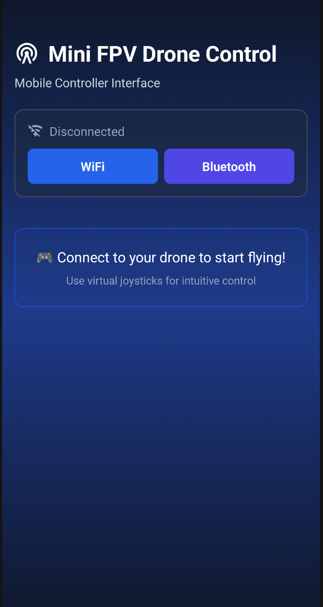
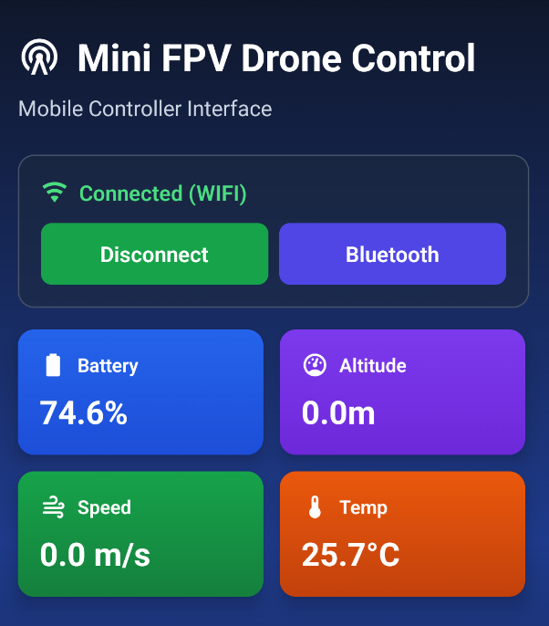
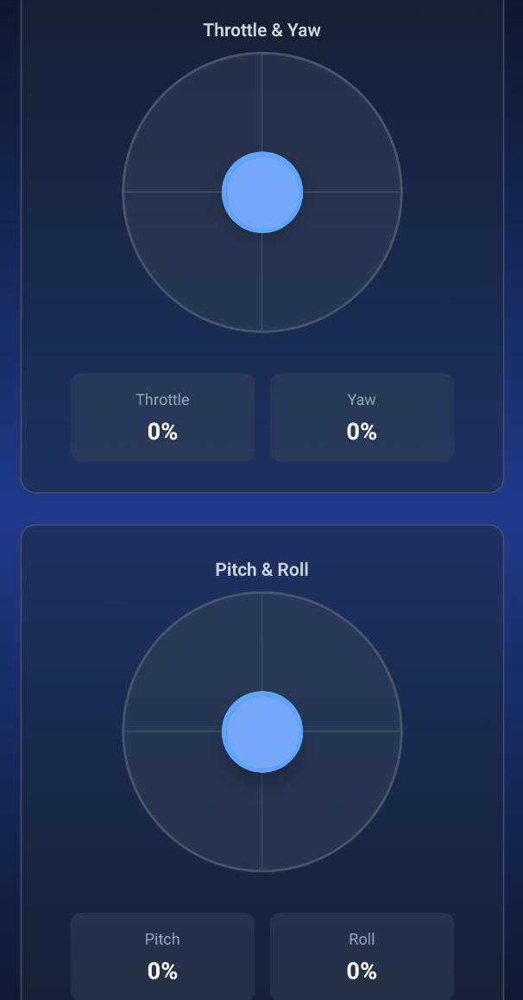

# 🚁 Mini FPV Drone Controller

<div align="center">


A mobile application for controlling mini FPV drones with an intuitive interface and virtual joysticks.

[Demo](#-demo) • [Installation](#-installation) • [Features](#-features) • [Usage](#-usage)

</div>

---

## 📱 Demo

### Screenshots

| Main Screen               | Connected                         | Flying                          |
| ------------------------- | --------------------------------- | ------------------------------- |
|  |  |  |

### Features

- ✈️ **Virtual Joysticks** - precise drone control
- 📡 **WiFi/Bluetooth** - two connection methods
- 📊 **Real-time Telemetry** - battery, altitude, speed, temperature
- 🎮 **Intuitive Interface** - easy to learn
- 🚨 **Emergency Stop** - safety first
- 📐 **Orientation Display** - pitch, roll, yaw
- 🌙 **Dark Theme** - easy on the eyes

---

## 🚀 Quick Start

### Prerequisites

- Node.js >= 18.0.0
- npm or yarn
- Expo Go app on your phone ([iOS](https://apps.apple.com/app/expo-go/id982107779) | [Android](https://play.google.com/store/apps/details?id=host.exp.exponent))

### Installation

```bash
# Clone the repository
git clone https://github.com/yourusername/fpv-drone-controller.git

# Navigate to directory
cd fpv-drone-controller

# Install dependencies
npm install

# Start the project
npm start
```

### Run on Device

1. **Install Expo Go** on your phone
2. **Start the project**: `npm start`
3. **Scan the QR code**:
   - iOS: open Camera app and point at QR code
   - Android: open Expo Go and tap "Scan QR code"

---

## 📦 Tech Stack

### Core Technologies

- **React Native** - cross-platform development
- **Expo** - infrastructure and tooling
- **Expo Linear Gradient** - beautiful gradients
- **Expo Vector Icons** - icon library

### Architecture

```
fpv-drone-controller/
├── App.js                      # Main component
├── components/                 # UI components
│   ├── Header.js              # Header
│   ├── ConnectionPanel.js     # Connection panel
│   ├── TelemetryGrid.js       # Telemetry display
│   ├── VirtualJoystick.js     # Joystick component
│   ├── JoysticksPanel.js      # Joysticks panel
│   ├── OrientationDisplay.js  # Drone orientation
│   ├── EmergencyButton.js     # Emergency button
│   └── InfoPanel.js           # Info panel
├── hooks/                      # Custom hooks
│   └── useTelemetry.js        # Telemetry hook
├── utils/                      # Utilities
│   └── constants.js           # Constants
└── styles/                     # Styles
    └── theme.js               # Theme configuration
```

---

## 🎮 Usage

### Connecting to Drone

1. Power on your drone
2. Choose connection type:
   - **WiFi** - for stable connection
   - **Bluetooth** - for mobility
3. Press connect button

### Controls

#### Left Stick (Throttle & Yaw)

- **Up/Down** - altitude control (throttle)
- **Left/Right** - rotation (yaw)

#### Right Stick (Pitch & Roll)

- **Up/Down** - forward/backward movement (pitch)
- **Left/Right** - left/right movement (roll)

### Telemetry

Real-time monitoring of:

- 🔋 **Battery** - battery level
- 📏 **Altitude** - flight altitude
- 💨 **Speed** - current speed
- 🌡️ **Temperature** - motor temperature

### Emergency Stop

In case of critical situation:

1. Press the red **🚨 EMERGENCY STOP** button
2. All motors will stop
3. Drone will disconnect

---

## 🔧 Configuration

### Configure Constants

Edit `utils/constants.js`:

```javascript
export const JOYSTICK_CONFIG = {
	size: 220, // Joystick size
	handleSize: 64, // Handle size
	maxDistance: 90, // Maximum displacement
}

export const TELEMETRY_UPDATE_INTERVAL = 100 // Update interval (ms)
```

### Configure Colors

Edit `styles/theme.js`:

```javascript
export const COLORS = {
	primary: {
		blue: ['#2563eb', '#1d4ed8'],
		// ... other colors
	},
}
```

---

## 🛠️ Development

### Scripts

```bash
# Start dev server
npm start

# Run on Android emulator
npm run android

# Run on iOS simulator (Mac only)
npm run ios

# Open in web browser
npm run web
```

### Component Structure

Each component has its own responsibility:

- **Header** - displays title and logo
- **ConnectionPanel** - manages connection
- **TelemetryGrid** - shows drone data
- **VirtualJoystick** - handles user input
- **JoysticksPanel** - combines two joysticks
- **OrientationDisplay** - shows tilt angles
- **EmergencyButton** - emergency stop
- **InfoPanel** - instructions and tips

### Custom Hooks

**useTelemetry** - manages telemetry data:

```javascript
const telemetry = useTelemetry(isConnected, leftStick, rightStick)
```

---

## 📝 API Integration

### Connect to Real Drone

Replace simulation in `hooks/useTelemetry.js` with real API:

```javascript
import { connectToDrone, getTelemetry } from './droneAPI'

export default function useTelemetry(isConnected, leftStick, rightStick) {
	useEffect(() => {
		if (isConnected) {
			const drone = connectToDrone()

			const interval = setInterval(async () => {
				const data = await getTelemetry(drone)
				setTelemetry(data)
			}, 100)

			return () => {
				clearInterval(interval)
				drone.disconnect()
			}
		}
	}, [isConnected])

	// ...
}
```

### WebSocket Example

```javascript
const ws = new WebSocket('ws://drone-ip:8080')

ws.onmessage = event => {
	const data = JSON.parse(event.data)
	setTelemetry(data)
}

// Send commands
ws.send(
	JSON.stringify({
		throttle: leftStick.y,
		yaw: leftStick.x,
		pitch: rightStick.y,
		roll: rightStick.x,
	})
)
```

---

## 🧪 Testing

```bash
# Run tests
npm test

# Run with coverage
npm test -- --coverage

# E2E tests (requires Detox)
npm run test:e2e
```

---

## 📱 Production Build

### Android

```bash
# Create APK
eas build --platform android

# Create AAB for Google Play
eas build --platform android --profile production
```

### iOS

```bash
# Create IPA
eas build --platform ios

# For App Store
eas build --platform ios --profile production
```

---

## 🤝 Contributing

Contributions are welcome!

### How to contribute:

1. Fork the project
2. Create your feature branch (`git checkout -b feature/AmazingFeature`)
3. Commit your changes (`git commit -m 'Add some AmazingFeature'`)
4. Push to the branch (`git push origin feature/AmazingFeature`)
5. Open a Pull Request

### Code Style

- Use the project's ESLint configuration
- Follow React Native best practices
- Write clear commit messages
- Add comments to complex code

---

## 🐛 Known Issues

- [ ] Lag on rapid joystick movements
- [ ] Bluetooth may lose connection at long distances
- [ ] iOS requires Bluetooth permissions

---

## 🗺️ Roadmap

- [x] Basic UI with joysticks
- [x] Telemetry simulation
- [x] Dark theme
- [ ] Real drone connection (WiFi/BT)
- [ ] FPV video stream
- [ ] Flight recording
- [ ] Calibration settings
- [ ] GPS map with trajectory
- [ ] Voice commands
- [ ] Multiple control profiles
- [ ] Cloud sync for settings

---

## 📄 License

This project is licensed under the MIT License. See the `LICENSE` file for details.

---

## 👨‍💻 Author

**Your Name**

- GitHub: [@yourusername](https://github.com/yourusername)
- Email: your.email@example.com

---

## 🙏 Acknowledgements

- [Expo](https://expo.dev/) - for the excellent platform
- [React Native](https://reactnative.dev/) - for cross-platform capabilities
- [Lucide React](https://lucide.dev/) - for beautiful icons
- FPV Community - for inspiration

---

## 📚 Useful Links

- [Expo Documentation](https://docs.expo.dev/)
- [React Native Documentation](https://reactnative.dev/docs/getting-started)
- [FPV Wiki](https://oscarliang.com/)
- [Betaflight](https://betaflight.com/) - popular drone firmware

---

<div align="center">

**Made with ❤️ for the FPV community**

⭐ Star this repo if you like it!

</div>
